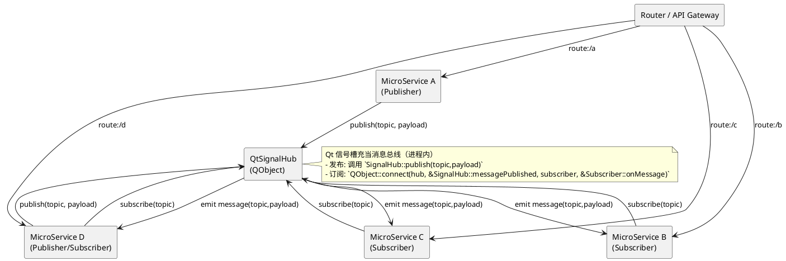

## 架构概览

下面的 UML 组件图展示了若干微服务通过路由（Router / API Gateway）相连，并借助一个基于 Qt 的 `SignalHub`（QObject）实现发布/订阅（publish/subscribe）。路由负责 HTTP / RPC 请求转发，`SignalHub` 负责进程/线程内的广播和订阅（基于 Qt 信号与槽）。



**要点**
- **路由**：负责将外部请求分发给对应的微服务（HTTP/GRPC/自定义RPC）。
- **SignalHub**：基于 Qt 的 `QObject`，提供 `publish(topic, QVariant)` 和信号 `messagePublished(QString,QVariant)`，实现进程内发布/订阅。
- **微服务**：可以既是发布者也可以是订阅者，通过路由对外提供 API，同时通过 `SignalHub` 进行内部事件广播。

**Qt 信号/槽 示例**

```cpp
// SignalHub.h
#pragma once
#include <QObject>
#include <QVariant>

class SignalHub : public QObject {
	Q_OBJECT
public:
	explicit SignalHub(QObject *parent = nullptr) : QObject(parent) {}

	void publish(const QString &topic, const QVariant &payload) {
		emit messagePublished(topic, payload);
	}

signals:
	void messagePublished(const QString &topic, const QVariant &payload);
};

// Service example: Publisher
// ServiceA.cpp
// hub->publish("sensor/temperature", 23.5);

// Service example: Subscriber
// ServiceB.cpp
// connect(hub, &SignalHub::messagePublished, this, &ServiceB::onMessage);
// void ServiceB::onMessage(const QString &topic, const QVariant &payload) {
//     if (topic == "sensor/temperature") { /* 处理 */ }
// }
```

渲染 PlantUML：可使用本地 PlantUML 或在线服务渲染 `architecture.puml`（本目录已提供）。


MicroServiceA
MicroServiceB
MicroServiceC
MicroServiceD
MicroServiceE 

